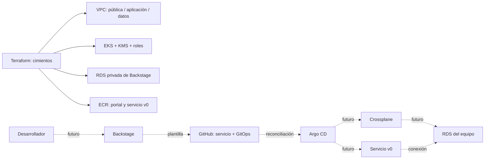

# Arquitectura preparada

Solo los módulos Terraform están preparados y validados estáticamente; ninguna caja representa un recurso desplegado por este repositorio. Las flechas discontinuas describen componentes todavía pendientes.

## Fronteras

- Terraform: VPC, EKS, IAM/KMS, RDS de Backstage, ECR y entrada opcional.
- Argo CD: componentes de plataforma y dos Applications por servicio (infraestructura y aplicación).
- Crossplane: RDS del equipo, con API limitada por tamaño y metadatos obligatorios.
- Backstage: cuatro campos, catálogo y generación de los repositorios/manifiestos.
- CI de este repositorio: validación sin credenciales; no administra AWS.

## Diferencias abiertas respecto de la presentación

1. **Entrada del portal:** el módulo heredado usa API Gateway HTTP y transporte HTTP privado en puerto 80 hasta NodePort 30080. Se debe resolver tipo de API, autenticación de navegador, callbacks OAuth, WAF y TLS interno; el módulo está desactivado. IAM provisional requiere peticiones firmadas y no equivale a OIDC del portal.
2. **Salida a Internet:** hay un NAT. No se implementaron VPC endpoints; no afirmar que los controladores operan sin Internet. GitHub y registros de charts/imágenes también requieren una ruta de salida o un mirror.
3. **Aislamiento:** RDS de Backstage acepta el SG de los workers. Es aislamiento frente a otras redes, no autorización por namespace. Definir SG por pod y políticas de red para aislamiento por carga.
4. **Credenciales:** AWS administra la contraseña RDS. External Secrets deberá sincronizarla y transformarla al formato del portal, con permisos mínimos; definir también rol PostgreSQL de aplicación y estrategia de rotación.
5. **Pod Identity:** módulo listo para recibir política IAM y service account. Falta la política de Crossplane, un DeploymentRuntimeConfig que mantenga estable esa cuenta de servicio, y comprobar soporte del SDK/provider seleccionado. El nodo mantiene la política CNI heredada; acotarla a una identidad dedicada antes de cerrar IAM.
6. **Malla:** los Helm values de referencia no configuran ambient ni el conjunto de políticas requerido.
7. **Operación:** dos t3.medium son una hipótesis inicial, no un dimensionamiento validado para Backstage/Crossplane/Argo/Kyverno/Istio.
8. **Red:** tres AZs y un NAT son una decisión para desarrollo; no ofrecen resiliencia zonal completa del egreso. El CIDR 10.60.0.0/16 todavía debe contrastarse con la cuenta destino.
9. **EKS privado:** requiere un ejecutor con ruta a la VPC para el futuro bootstrap. No hay acceso implícito desde GitHub-hosted runners.

Referencias técnicas: [EKS Pod Identity](https://docs.aws.amazon.com/eks/latest/userguide/pod-identities.html), [pruebas Terraform con mocks](https://developer.hashicorp.com/terraform/language/tests/mocking).
