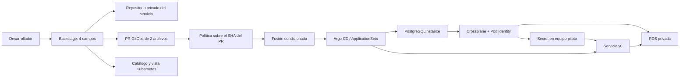
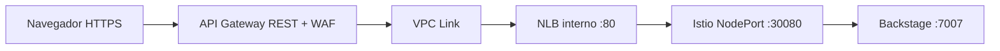

# Arquitectura de GoldenPath

Para el detalle operativo, consultar las [cuatro vistas](vistas/README.md). Las razones y alternativas están en los [ADRs](adr/README.md).

## Flujo de autoservicio

El repositorio del servicio contiene código, CI, manifiestos y `catalog-info.yaml`. La solicitud GitOps contiene únicamente `database.yaml` y `service.json`. La política comprueba identidad del repositorio, namespace, nombre, dueño, centro de costo y tamaño; impide agregar recursos arbitrarios. Backstage solo fusiona cuando el check `goldenpath-policy`, emitido por GitHub Actions, pasa para el SHA actual.

## Propiedad de recursos

Terraform administra VPC, tres AZs, subredes, un NAT de demo, EKS 1.35, dos workers t3.large, roles, RDS de Backstage, ECR y entrada del portal. Crossplane administra las RDS de los servicios. Argo CD reconcilia controladores, plataforma y servicios. Cada equipo tiene un namespace; esta TVP implementa un único equipo `piloto` en `equipo-piloto`.

GoldenPath utiliza recursos y estados propios. Los módulos conservan su procedencia técnica documentada; sus interfaces se adaptaron a la plataforma.

## Portal y autenticación

Se eligió API Gateway REST para asociar WAF regional. La URL pública incluye `/dev`; API Gateway elimina ese prefijo al enviar la petición al backend. Backstage genera URLs y callbacks con el prefijo externo. TLS termina en API Gateway; el tramo privado NLB/ingress/Backstage usa HTTP. Es una limitación deliberada de la demo, no cifrado extremo a extremo.

La autenticación GitHub la exige Backstage para sus APIs. Los recursos estáticos y callbacks de OAuth deben ser accesibles antes del login. No se configura un authorizer adicional en API Gateway. El catálogo de usuarios limita quién puede iniciar sesión; las acciones validan pertenencia al equipo. La política de permisos impide registrar ubicaciones/plantillas arbitrarias desde un usuario. Las credenciales de integración no se envían al navegador.

Para una cuenta personal de GitHub, la creación de repositorios se prepara con PAT y el login con OAuth App. Una instalación GitHub App no crea repositorios bajo una cuenta personal como lo hace en una organización. El nombre del secreto `github-app` se conserva como contenedor de la integración, aunque sus campos son OAuth + PAT. Migrar a una organización permite sustituir el PAT por una GitHub App con permisos acotados.

## Bases, identidad y secretos

PostgreSQL 16.15, almacenamiento cifrado y privado. Backstage usa una contraseña administrada en Secrets Manager; External Secrets la entrega como Secret y la conexión verifica el certificado RDS. La plataforma crea metadatos del secreto GitHub; su valor se incorpora fuera de Git antes del bootstrap.

El proveedor RDS v2.8.1 usa recursos namespaced `rds.aws.m.upbound.io/v1beta1`, `ClusterProviderConfig` con `source: PodIdentity`, service account estable y rol de AWS limitado al prefijo de las bases piloto. Crossplane genera el password y escribe `host`, `port`, `username`, `password` en `<servicio>-connection`; la aplicación utiliza la base `app`. Las composiciones pequeñas/medianas producen `db.t4g.micro`/`db.t4g.small`.

Las RDS del piloto tienen protección contra borrado y management policies que excluyen Delete. Borrar una solicitud no equivale a borrar la base. La retención evita pérdida accidental, pero requiere cierre explícito para no dejar costos residuales.

## Aislamiento

AppProjects separan plataforma, infraestructura piloto y servicios. El equipo no puede modificar roles, secretos, políticas de red o recursos de otros namespaces mediante su repositorio. Kyverno exige owner/cost-center/tamaño válidos. Se preparan cuotas, Pod Security restricted, default-deny, DNS y acceso a RDS. Security Groups for Pods limita RDS piloto a workloads etiquetados; Backstage conserva su base separada. Istio ambient y PeerAuthentication STRICT protegen el tráfico de malla del piloto.

La interacción real entre EKS VPC CNI, Security Groups for Pods, NetworkPolicy e Istio se debe comprobar en AWS. Los dry-runs locales validan manifiestos y admisión, no tráfico de red ni credenciales temporales.

## Reconciliación inicial

Helm instala Argo CD y el chart bootstrap con sus Applications. Como el bootstrap es Helm, las anotaciones de sync-wave no serializan por sí mismas todas las Applications iniciales: Argo reintenta mientras aparecen CRDs y dependencias. Los health checks y retry están configurados; antes de la demo se exige que todas las Applications estén Healthy/Synced. Los ApplicationSets solo despliegan solicitudes versionadas.
