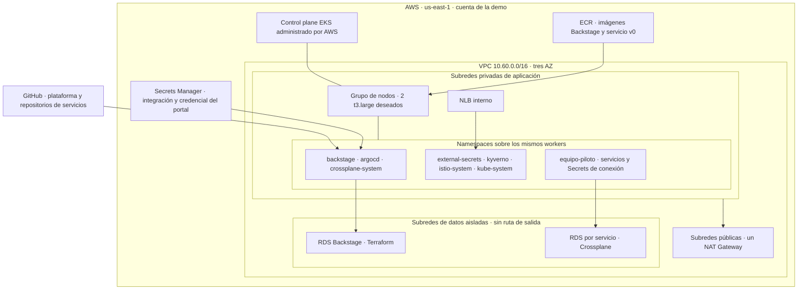

# Vista 1 · Ubicación física

La PoC usa una cuenta, una región y un único EKS. La separación entre gestión y aplicaciones se implementa por namespaces y permisos; comparten nodos y dominio de falla.

| Zona | CIDR declarado | Función |
|---|---|---|
| Pública | `10.60.0.0/24`, `10.60.1.0/24`, `10.60.2.0/24` | Ruta a Internet Gateway; NAT en una AZ |
| Aplicación | `10.60.16.0/20`, `10.60.32.0/20`, `10.60.48.0/20` | Workers y NLB interno; salida por NAT |
| Datos | `10.60.64.0/24`, `10.60.65.0/24`, `10.60.66.0/24` | Subnet groups RDS sin ruta a NAT/Internet Gateway |

Los subnet groups abarcan tres AZ, pero ambas clases de base están configuradas Single-AZ. El grupo EKS tiene deseado 2, mínimo 1 y máximo 3; esos límites no instalan un autoscaler. No se garantiza un worker en cada AZ. La disponibilidad y capacidad reales requieren ensayo.

**Fuentes del código:** [root Terraform](../../terraform/main.tf), [red](../../terraform/modules/network/main.tf), [EKS](../../terraform/modules/eks/main.tf), [bootstrap](../../platform/charts/bootstrap/templates/applications.yaml).

La evolución a hub y spokes en cuentas distintas se justifica cuando aislamiento, disponibilidad o número de equipos superen esta PoC. Implica roles entre cuentas, conectividad privada y más clústeres; no se representa como un ahorro gratuito. Ver [ADR-002](../adr/002-UN-EKS-Y-NAMESPACE-POR-EQUIPO.md).
