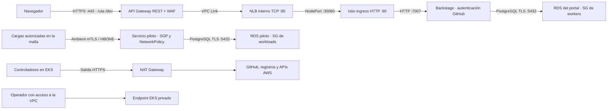

# Vista 2 · Red y fronteras de confianza

API Gateway es la entrada pública del portal. La API de administración de EKS es privada por defecto y puede habilitarse solo para CIDRs administrativos explícitos. Son superficies diferentes.

| Frontera | Control configurado | Límite o comprobación pendiente |
|---|---|---|
| Navegador → portal | HTTPS administrado, WAF por IP y throttling | Sin authorizer OIDC en API Gateway; Backstage controla sus APIs. Probar cookies/callback `/dev`. |
| Gateway → Backstage | VPC Link, NLB interno y SG hacia NodePort | Tramo HTTP privado; no se declara TLS extremo a extremo. |
| Usuario → GitHub | OAuth para login; PAT de integración en servidor | Revisar permisos efectivos y usuario presente en catálogo antes del ensayo. |
| Servicio → RDS piloto | SGP por etiqueta, SG de base y salida NetworkPolicy :5432 a datos | Probar SGP + VPC CNI + ambient en EKS. |
| Backstage → su RDS | TLS con CA verificada; SG de workers | El SG no es exclusivo del namespace backstage. |
| Piloto → malla | Ambient, PeerAuthentication STRICT y AuthorizationPolicy | Solo se declara para el piloto; no es mTLS para todo el clúster. |
| Controladores → AWS | Pod Identity por service account y políticas IAM | Autorización de creación aún no comprobada; transporte por NAT, sin VPC endpoints creados. |
| Administración → EKS | Endpoint privado o CIDRs permitidos y access entries | La máquina de bootstrap necesita conectividad y permisos. |

El namespace piloto comienza con denegación de ingress/egress. Se permiten DNS hacia kube-system, RDS hacia subredes de datos y entrada de las cargas previstas. Los controles de Kubernetes y AWS se complementan, pero los manifiestos válidos no prueban conectividad ni aislamiento efectivo.

**Fuentes:** [entrada](../../terraform/modules/portal-edge/main.tf), [SG e identidad](../../terraform/platform.tf), [políticas del equipo](../../platform/charts/config/templates/teams.yaml), [rutas del portal](../../platform/charts/config/templates/backstage.yaml), [autenticación](../../backstage/app-config.production.yaml). Ver [ADR-003](../adr/003-ENTRADA-Y-AUTENTICACION.md).
