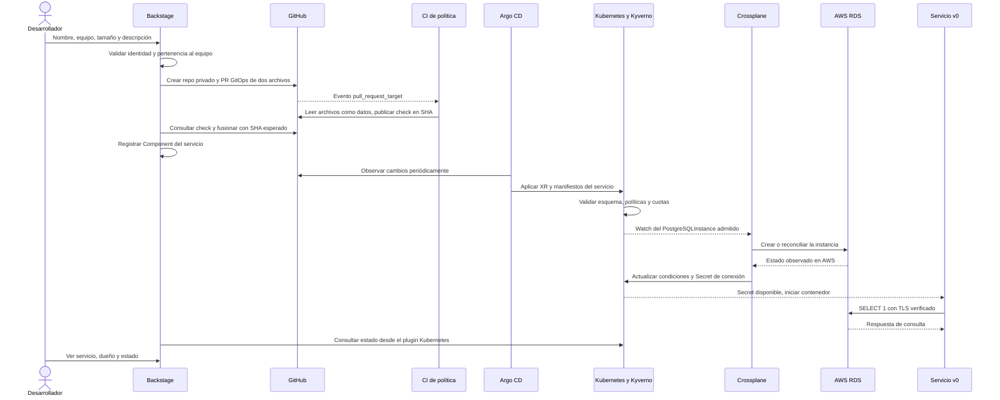

# Vista 3 · Control y eventos asíncronos

Git conserva el estado deseado. El portal produce una solicitud; los controladores la observan y convergen de forma independiente. No se ha configurado un webhook GitHub hacia Argo CD: la revisión de Git depende del polling de los controladores.

| Dato que conecta componentes | Productor → consumidor |
|---|---|
| PR con `database.yaml` y `service.json` | Plantilla → validador y ApplicationSets |
| Check `goldenpath-policy` + SHA | GitHub Actions → acción `goldenpath:merge` |
| `platform.goldenpath.io/owner`, `cost-center` | Plantilla → Kyverno y tags de RDS |
| `backstage.io/kubernetes-id` y namespace | Plantilla → plugin Kubernetes |
| Condiciones `Ready` y `Synced` | Crossplane → salud de Argo y observación del portal |
| `<servicio>-connection` | Proveedor RDS → variables PG del contenedor |
| `catalog-info.yaml` | Repositorio del servicio → catálogo de Backstage |

La finalización del task de Backstage significa que se publicaron y registraron los artefactos, **no que RDS ya esté Ready**. El Deployment puede existir antes del Secret; Kubernetes reintenta hasta poder iniciar. La readiness del servicio requiere una consulta real. El catálogo puede tardar un ciclo en procesar la entidad.

Si la política falla, no se fusiona la solicitud y Argo no crea su infraestructura desde ella. Si la creación del repo ocurrió antes de otro fallo, puede quedar un repo sin servicio: conservar task/PR y diagnosticar; no repetir ciegamente con el mismo nombre. Crossplane reconcilia campos que administra; comprobar drift de un campo concreto antes de generalizar a todos los cambios externos.

**Fuentes:** [acciones](../../backstage/packages/backend/src/modules/goldenpath.ts), [plantilla](../../backstage/templates/microservice/template.yaml), [política CI](../../.github/workflows/goldenpath-policy.yml), [ApplicationSets](../../platform/charts/config/templates/applicationsets.yaml), [Composition](../../platform/charts/config/templates/database.yaml).
