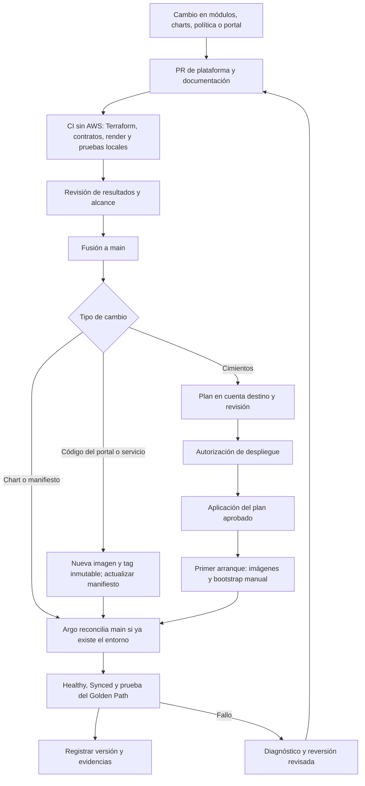

# Vista 4 · Ciclo de vida de la plataforma

La plataforma tiene su propia entrega. Un cambio de Composition o permisos puede afectar varios servicios; su revisión y validación se separan de un cambio de código del equipo piloto.

## Estado actual

CI no tiene credenciales AWS ni realiza despliegues. Plan/apply, publicación de imágenes y bootstrap están preparados como operaciones manuales con bloqueo. Argo observa `main` una vez instalado: **una fusión posterior que cambie sus charts puede modificar el clúster automáticamente**; el gate de los scripts no deshabilita la reconciliación de Argo.

No hay staging ni producción, promoción por tags ni canarios activos. Kind se usó para validar esquemas/admisión; no creó RDS reales. Las versiones de charts y los locks están fijados, pero el bootstrap Helm se ejecuta manualmente y sus valores no se actualizan solo por editar el chart en Git. Ver [ADR-007](../adr/007-ENTREGA-Y-RECUPERACION.md).

## Promoción propuesta

Para ampliar la plataforma: validar primero en un entorno de prueba que cree un recurso real, fijar una release, ensayar con un equipo canario y promover la misma versión. Adoptar selección explícita de CompositionRevision antes de prometer que cada equipo puede permanecer en una versión anterior. Son decisiones futuras, no funciones desplegadas.

## Recuperación

- **Manifiestos:** revisar y revertir el commit causante, observar la reconciliación y comprobar salud. No asumir que deshacer YAML revierte migraciones de datos.
- **Imagen:** conservar el tag anterior y apuntar el manifiesto a él mediante Git; no sobrescribir tags ECR inmutables.
- **Terraform:** generar un nuevo plan que revierta el cambio deseado. No reutilizar planes obsoletos ni tratar el estado como código para hacer rollback.
- **Datos:** usar el proceso de snapshot/restauración validado para el caso; retención o protección de borrado no sustituyen un ensayo de restauración.

Las RDS piloto se retienen y el ApplicationSet conserva recursos al borrarse. Retirar archivos de Git no es una baja completa. Seguir [operación y cierre](../OPERACION.md) antes de quitar controladores/EKS.

**Fuentes:** [CI](../../.github/workflows/ci.yml), [bootstrap](../../scripts/bootstrap-platform.sh), [publicación](../../scripts/publish-images.sh), [ApplicationSets](../../platform/charts/config/templates/applicationsets.yaml), [plan](../../scripts/plan-aws.sh).
